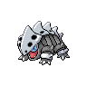
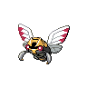
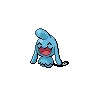
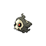

# Desert resort - main

| Trainer            | 1                                                                                                 | 2                                                                                                   | 3                                                                                                 | 4                                                                                               |
| ------------------ | ------------------------------------------------------------------------------------------------- | --------------------------------------------------------------------------------------------------- | ------------------------------------------------------------------------------------------------- | ----------------------------------------------------------------------------------------------- |
| Doctor Jerry       |   [Chansey](#/pokemon/113)  Lv. 30   |
| Backpacker Kelsey  |   [Togetic](#/pokemon/176)  Lv. 29   |   [Sunflora](#/pokemon/192)  Lv. 29   |   [Luvdisc](#/pokemon/370)  Lv. 29   |
| Pkmn Ranger Mylene |   [Lairon](#/pokemon/305)  Lv. 32     |   [Ninjask](#/pokemon/291)  Lv. 32     |
| Pkmn Ranger Jaden  |   [Swellow](#/pokemon/277)  Lv. 32   |   [Sudowoodo](#/pokemon/185)  Lv. 32 |
| Backpacker Nate    |   [Barboach](#/pokemon/339)  Lv. 29 |   [Kecleon](#/pokemon/352)  Lv. 29     |   [Granbull](#/pokemon/210)  Lv. 29 |
| Backpacker Liz     |   [Shellder](#/pokemon/090)  Lv. 29 |   [Rufflet](#/pokemon/627)  Lv. 29     |   [Vullaby](#/pokemon/629)  Lv. 29   |
| Psychic Cybil      |   [Gothita](#/pokemon/574)  Lv. 28   |   [Solosis](#/pokemon/577)  Lv. 28     |   [Yamask](#/pokemon/562)  Lv. 28     |   [Haunter](#/pokemon/093)  Lv. 28 |
| Psychic Low        |   [Wynaut](#/pokemon/360)  Lv. 30     |   [Chimecho](#/pokemon/358)  Lv. 30   |
| Backpacker Elaine  |   [Krabby](#/pokemon/098)  Lv. 29     |   [Cubchoo](#/pokemon/613)  Lv. 29     |   [Tirtouga](#/pokemon/564)  Lv. 29 |
| Psychic Gavin      |   [Duskull](#/pokemon/355)  Lv. 30   |   [Shuppet](#/pokemon/353)  Lv. 30     |