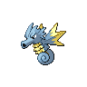
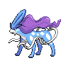

# Dragonspiral Tower - Outside

## Wild Encounters

| Area                                                                             | Pokemon                                                                                        | &nbsp;                                                                                                                 | &nbsp;                                                                                           | &nbsp;                                                                                          | &nbsp;                                                                                       |
| -------------------------------------------------------------------------------- | ---------------------------------------------------------------------------------------------- | ---------------------------------------------------------------------------------------------------------------------- | ------------------------------------------------------------------------------------------------ | ----------------------------------------------------------------------------------------------- | -------------------------------------------------------------------------------------------- |
|  grass-normal           |   [Mienfoo](#/pokemon/619)  20%   |   [Deerling](#/pokemon/585)  20%                         |   [Druddigon](#/pokemon/621)  20% |   [Swablu](#/pokemon/333)  20%      |   [Kadabra](#/pokemon/064)  20% |
|  grass-doubles        |   [Mienshao](#/pokemon/620)  20% |   [Sawsbuck](#/pokemon/586)  20%                         |   [Druddigon](#/pokemon/621)  20% |   [Altaria](#/pokemon/334)  20%    |   [Kadabra](#/pokemon/064)  20% |
|  grass-special        |   [Audino](#/pokemon/531)  90%     |   [Alakazam](#/pokemon/065)  10%                         |
|  surf-normal              |   [Horsea](#/pokemon/116)  60%     |   [Dratini](#/pokemon/147)  40%                           |
|  surf-special           |   [Seadra](#/pokemon/117)  60%     |   [Dragonair](#/pokemon/148)  40%                       |
|  fishing-normal     |   [Horsea](#/pokemon/116)  60%     |   [Basculin-red-striped](#/pokemon/550)  30% |   [Dratini](#/pokemon/147)  10%     |
|  fishing-special  |   [Seadra](#/pokemon/117)  60%     |   [Dragonair](#/pokemon/148)  30%                       |   [Kingdra](#/pokemon/230)  9%      |   [Dragonite](#/pokemon/149)  1% |
| legendary-encounter surf-special                                             |   [Suicune](#/pokemon/245)  1%    |
## Trainers

| Trainer           | 1                                                                                             | 2                                                                                                     | 3                                                                                                   | 4                                                                                           | 5                                                                                               |
| ----------------- | --------------------------------------------------------------------------------------------- | ----------------------------------------------------------------------------------------------------- | --------------------------------------------------------------------------------------------------- | ------------------------------------------------------------------------------------------- | ----------------------------------------------------------------------------------------------- |
| Ace Trainer Jesse |   [Onix](#/pokemon/095)  Lv. 53     |   [Hitmonchan](#/pokemon/107)  Lv. 55 |   [Hitmonlee](#/pokemon/106)  Lv. 55 |   [Onix](#/pokemon/095)  Lv. 56   |   [Machamp](#/pokemon/068)  Lv. 58 |
| Ace Trainer Jamie |   [Gengar](#/pokemon/094)  Lv. 58 |   [Golbat](#/pokemon/042)  Lv. 56         |   [Haunter](#/pokemon/093)  Lv. 55     |   [Arbok](#/pokemon/024)  Lv. 58 |   [Gengar](#/pokemon/094)  Lv. 60   |
