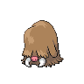
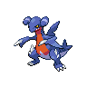
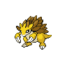
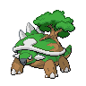
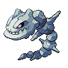

# Driftveil city gym

| Trainer                                                                                     | 1                                                                                                   | 2                                                                                                     | 3                                                                                                   | 4                                                                                                   | 5                                                                                                     | 6                                                                                                   |
| ------------------------------------------------------------------------------------------- | --------------------------------------------------------------------------------------------------- | ----------------------------------------------------------------------------------------------------- | --------------------------------------------------------------------------------------------------- | --------------------------------------------------------------------------------------------------- | ----------------------------------------------------------------------------------------------------- | --------------------------------------------------------------------------------------------------- |
| Worker Felix                                                                                |   [Sandile](#/pokemon/551)  Lv. 38     |   [Gible](#/pokemon/443)  Lv. 38           |   [Piloswine](#/pokemon/221)  Lv. 38 |   [Rhyhorn](#/pokemon/111)  Lv. 38     |
| Worker Don                                                                                  |   [Larvitar](#/pokemon/246)  Lv. 38   |   [Onix](#/pokemon/095)  Lv. 38             |   [Gabite](#/pokemon/444)  Lv. 38       |   [Sandslash](#/pokemon/028)  Lv. 38 |
| Worker Sterling                                                                             |   [Gligar](#/pokemon/207)  Lv. 37       |   [Palpitoad](#/pokemon/536)  Lv. 37   |   [Nidoking](#/pokemon/034)  Lv. 37   |   [Vibrava](#/pokemon/329)  Lv. 37     |
| Clerk Isaac                                                                                 |   [Camerupt](#/pokemon/323)  Lv. 39   |   [Whiscash](#/pokemon/340)  Lv. 39     |   [Torterra](#/pokemon/389)  Lv. 39   |   [Claydol](#/pokemon/344)  Lv. 39     |
| Clerk Katie                                                                                 |   [Pupitar](#/pokemon/247)  Lv. 38     |   [Nidoqueen](#/pokemon/031)  Lv. 38   |   [Donphan](#/pokemon/232)  Lv. 38     |   [Dugtrio](#/pokemon/051)  Lv. 38     |
| Leader Clay   |   [Hippowdon](#/pokemon/450)  Lv. 42 |   [Seismitoad](#/pokemon/537)  Lv. 42 |   [Steelix](#/pokemon/208)  Lv. 42     |   [Marowak](#/pokemon/105)  Lv. 42     |   [Krookodile](#/pokemon/553)  Lv. 42 |   [Excadrill](#/pokemon/530)  Lv. 44 |

## Leader Clay

|                             | Item                                                                 | Nature | Ability      | Moves                                                                                  |
| ----------------------------------------------------------------------------------------------------- | -------------------------------------------------------------------- | ------ | ------------ | -------------------------------------------------------------------------------------- |
|   [Hippowdon](#/pokemon/450)  Lv. 42   | N/A                                                                  | N/A    | Sand-Stream  | <ul><li>Bulldoze</li><li>Slack-Off</li><li>Stealth-Rock</li><li>Stone-Edge</li></ul>   |
|   [Seismitoad](#/pokemon/537)  Lv. 42 |    Chesto berry | N/A    | Water-Absorb | <ul><li>Earth-Power</li><li>Muddy-Water</li><li>Sludge-Wave</li><li>Rest</li></ul>     |
|   [Steelix](#/pokemon/208)  Lv. 42       |    Passho berry | N/A    | Sturdy       | <ul><li>Earthquake</li><li>Fire-Fang</li><li>Gyro-Ball</li><li>Coil</li></ul>          |
|   [Marowak](#/pokemon/105)  Lv. 42       |    Thick club       | N/A    | Mold-Breaker | <ul><li>Earthquake</li><li>Stone-Edge</li><li>Low-Kick</li><li>Perish-Song</li></ul>   |
|   [Krookodile](#/pokemon/553)  Lv. 42 |    Persim berry | N/A    | Intimidate   | <ul><li>Earthquake</li><li>Crunch</li><li>Thrash</li><li>Torment</li></ul>             |
|   [Excadrill](#/pokemon/530)  Lv. 44   |    Sitrus berry | N/A    | Sand-Rush    | <ul><li>Earthquake</li><li>Rock-Slide</li><li>X-Scissor</li><li>Swords-Dance</li></ul> |