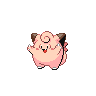
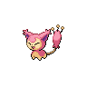
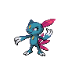
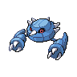
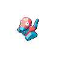
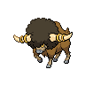
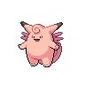
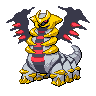
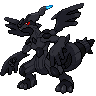

# Giant Chasm - Inside Plains

## Wild Encounters

| Area                                                                       | Pokemon                                                                                                       | &nbsp;                                                                                             | &nbsp;                                                                                             | &nbsp;                                                                                          | &nbsp;                                                                                          | &nbsp;                                                                                           |
| -------------------------------------------------------------------------- | ------------------------------------------------------------------------------------------------------------- | -------------------------------------------------------------------------------------------------- | -------------------------------------------------------------------------------------------------- | ----------------------------------------------------------------------------------------------- | ----------------------------------------------------------------------------------------------- | ------------------------------------------------------------------------------------------------ |
|  grass-normal     |   [Clefairy](#/pokemon/035)  20%                |   [Jigglypuff](#/pokemon/039)  20% |   [Skitty](#/pokemon/300)  10%         |   [Sneasel](#/pokemon/215)  10%    |   [Metang](#/pokemon/375)  10%      |   [Vanillish](#/pokemon/583)  10% |
|                                                                            |   [Golbat](#/pokemon/042)  10%                    |   [Porygon](#/pokemon/137)  10%       |
|  grass-doubles  |   [Piloswine](#/pokemon/221)  20%              |   [Abomasnow](#/pokemon/460)  20%   |   [Bouffalant](#/pokemon/626)  10% |   [Solrock](#/pokemon/338)  10%    |   [Lunatone](#/pokemon/337)  10%  |   [Skiploom](#/pokemon/188)  10%   |
|                                                                            |   [Metang](#/pokemon/375)  10%                    |   [Ditto](#/pokemon/132)  10%           |
|  grass-special  |   [Audino](#/pokemon/531)  80%                    |   [Clefable](#/pokemon/036)  5%      |   [Wigglytuff](#/pokemon/040)  5%  |   [Mamoswine](#/pokemon/473)  5% |   [Metagross](#/pokemon/376)  5% |
| legendary-encounter grass-doubles                                      |   [Giratina-altered](#/pokemon/487)  1% |   [Zekrom](#/pokemon/644)  1%          |
