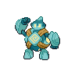

# Nimbasa city

| Trainer                                                                                        | 1                                                                                                     | 2                                                                                                 | 3                                                                                             | 4                                                                                                 | 5                                                                                             | 6                                                                                                 |
| ---------------------------------------------------------------------------------------------- | ----------------------------------------------------------------------------------------------------- | ------------------------------------------------------------------------------------------------- | --------------------------------------------------------------------------------------------- | ------------------------------------------------------------------------------------------------- | --------------------------------------------------------------------------------------------- | ------------------------------------------------------------------------------------------------- |
| Plasma Grunt                                                                                   |   [Mawile](#/pokemon/303)  Lv. 31         |   [Sableye](#/pokemon/302)  Lv. 31   |
| Pkmn Trainer N   |   [Hippopotas](#/pokemon/449)  Lv. 33 |   [Maractus](#/pokemon/556)  Lv. 33 |   [Gligar](#/pokemon/207)  Lv. 33 |   [Larvesta](#/pokemon/636)  Lv. 33 |   [Golett](#/pokemon/622)  Lv. 33 |   [Sigilyph](#/pokemon/561)  Lv. 33 |

## Pkmn Trainer N

|                             | Item | Nature | Ability | Moves                                                     |
| ----------------------------------------------------------------------------------------------------- | ---- | ------ | ------- | --------------------------------------------------------- |
|   [Hippopotas](#/pokemon/449)  Lv. 33 | N/A  | N/A    | N/A     | <ul><li>N/A</li><li>N/A</li><li>N/A</li><li>N/A</li></ul> |
|   [Maractus](#/pokemon/556)  Lv. 33     | N/A  | N/A    | N/A     | <ul><li>N/A</li><li>N/A</li><li>N/A</li><li>N/A</li></ul> |
|   [Gligar](#/pokemon/207)  Lv. 33         | N/A  | N/A    | N/A     | <ul><li>N/A</li><li>N/A</li><li>N/A</li><li>N/A</li></ul> |
|   [Larvesta](#/pokemon/636)  Lv. 33     | N/A  | N/A    | N/A     | <ul><li>N/A</li><li>N/A</li><li>N/A</li><li>N/A</li></ul> |
|   [Golett](#/pokemon/622)  Lv. 33         | N/A  | N/A    | N/A     | <ul><li>N/A</li><li>N/A</li><li>N/A</li><li>N/A</li></ul> |
|   [Sigilyph](#/pokemon/561)  Lv. 33     | N/A  | N/A    | N/A     | <ul><li>N/A</li><li>N/A</li><li>N/A</li><li>N/A</li></ul> |