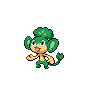
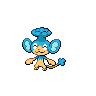
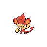
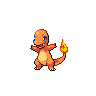
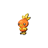
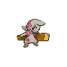
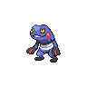
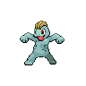
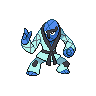

# Pinwheel forest - outside

| Trainer             | 1                                                                                                     | 2                                                                                                 | 3                                                                                                     | 4                                                                                           |
| ------------------- | ----------------------------------------------------------------------------------------------------- | ------------------------------------------------------------------------------------------------- | ----------------------------------------------------------------------------------------------------- | ------------------------------------------------------------------------------------------- |
| Nurse Shery         |   [Happiny](#/pokemon/440)  Lv. 18       |   [Audino](#/pokemon/531)  Lv. 18     |
| Preschooler Juliet  |   [Pansage](#/pokemon/511)  Lv. 18       |   [Panpour](#/pokemon/515)  Lv. 18   |   [Pansear](#/pokemon/513)  Lv. 18       |
| Preschooler Homer   |   [Roggenrola](#/pokemon/524)  Lv. 18 |   [Geodude](#/pokemon/074)  Lv. 18   |   [Aron](#/pokemon/304)  Lv. 18             |
| Youngster Keita     |   [Spinarak](#/pokemon/167)  Lv. 18     |   [Doduo](#/pokemon/084)  Lv. 18       |   [Charmander](#/pokemon/004)  Lv. 18 |
| Youngster Zachary   |   [Burmy](#/pokemon/412)  Lv. 18           |   [Torchic](#/pokemon/255)  Lv. 18   |   [Ledyba](#/pokemon/165)  Lv. 18         |
| Battle Girl Lee     |   [Timburr](#/pokemon/532)  Lv. 18       |   [Croagunk](#/pokemon/453)  Lv. 18 |   [Tyrogue](#/pokemon/236)  Lv. 18       |   [Throh](#/pokemon/538)  Lv. 18 |
| Battle Girl Kentaro |   [Machop](#/pokemon/066)  Lv. 18         |   [Meditite](#/pokemon/307)  Lv. 18 |   [Riolu](#/pokemon/447)  Lv. 18           |   [Sawk](#/pokemon/539)  Lv. 18   |