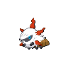

# Relic castle - b1f

| Area                                                                 | Pokemon                                                                                      | &nbsp;                                                                                     | &nbsp;                                                                                        | &nbsp;                                                                                        | &nbsp;                                                                                       | &nbsp;                                                                                     |
| -------------------------------------------------------------------- | -------------------------------------------------------------------------------------------- | ------------------------------------------------------------------------------------------ | --------------------------------------------------------------------------------------------- | --------------------------------------------------------------------------------------------- | -------------------------------------------------------------------------------------------- | ------------------------------------------------------------------------------------------ |
|  sand-normal  |   [Yamask](#/pokemon/562)  20%   |   [Gastly](#/pokemon/092)  20% |   [Shuckle](#/pokemon/213)  10%  |   [Duskull](#/pokemon/355)  10%  |   [Bronzor](#/pokemon/436)  10% |   [Elgyem](#/pokemon/605)  10% |
|                                                                      |   [Litwick](#/pokemon/607)  10% |   [Beldum](#/pokemon/374)  4%  |   [Larvitar](#/pokemon/246)  4% |   [Larvesta](#/pokemon/636)  2% |