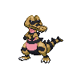

# Relic Castle - B3F

## Wild Encounters

| Area                                                                 | Pokemon                                                                                        | &nbsp;                                                                                             | &nbsp;                                                                                                              | &nbsp;                                                                                           | &nbsp;                                                                                           | &nbsp;                                                                                       |
| -------------------------------------------------------------------- | ---------------------------------------------------------------------------------------------- | -------------------------------------------------------------------------------------------------- | ------------------------------------------------------------------------------------------------------------------- | ------------------------------------------------------------------------------------------------ | ------------------------------------------------------------------------------------------------ | -------------------------------------------------------------------------------------------- |
|  sand-normal  |   [Krokorok](#/pokemon/552)  20% |   [Cofagrigus](#/pokemon/563)  20% |   [Vibrava](#/pokemon/329)  10%                        |   [Hippowdon](#/pokemon/450)  10% |   [Sandslash](#/pokemon/028)  10% |   [Claydol](#/pokemon/344)  10% |
|                                                                      |   [Sigilyph](#/pokemon/561)  5%  |   [Crustle](#/pokemon/558)  5%        |   [Darmanitan-standard](#/pokemon/555)  5% |   [Camerupt](#/pokemon/323)  5%    |
## Trainers

| Trainer             | 1                                                                                               | 2                                                                                               | 3                                                                                                 |
| ------------------- | ----------------------------------------------------------------------------------------------- | ----------------------------------------------------------------------------------------------- | ------------------------------------------------------------------------------------------------- |
| Team Plasma Grunt 4 |   [Weezing](#/pokemon/110)  Lv. 58 |   [Muk](#/pokemon/089)  Lv. 58         |   [Garbodor](#/pokemon/569)  Lv. 58 |
| Team Plasma Grunt 5 |   [Scrafty](#/pokemon/560)  Lv. 59 |   [Liepard](#/pokemon/510)  Lv. 59 |
