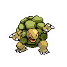
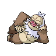
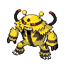

# Rotue 18

## Wild Encounters

| Area                                                                       | Pokemon                                                                                            | &nbsp;                                                                                       | &nbsp;                                                                                           | &nbsp;                                                                                         | &nbsp;                                                                                       | &nbsp;                                                                                           |
| -------------------------------------------------------------------------- | -------------------------------------------------------------------------------------------------- | -------------------------------------------------------------------------------------------- | ------------------------------------------------------------------------------------------------ | ---------------------------------------------------------------------------------------------- | -------------------------------------------------------------------------------------------- | ------------------------------------------------------------------------------------------------ |
|  grass-normal     |   [Throh](#/pokemon/538)  20%           |   [Sawk](#/pokemon/539)  20%       |   [Heracross](#/pokemon/214)  10% |   [Munchlax](#/pokemon/446)  10% |   [Dwebble](#/pokemon/557)  10% |   [Lickitung](#/pokemon/108)  10% |
|                                                                            |   [Kangaskhan](#/pokemon/115)  10% |   [Tropius](#/pokemon/357)  10% |
|  grass-doubles  |   [Throh](#/pokemon/538)  20%           |   [Sawk](#/pokemon/539)  20%       |   [Heracross](#/pokemon/214)  10% |   [Munchlax](#/pokemon/446)  10% |   [Crustle](#/pokemon/558)  10% |   [Lickitung](#/pokemon/108)  10% |
|                                                                            |   [Kangaskhan](#/pokemon/115)  10% |   [Tropius](#/pokemon/357)  10% |
| special-encounter surf-special                                         |   [Phione](#/pokemon/489)  1%          |
## Trainers

| Trainer             | 1                                                                                                     | 2                                                                                                     | 3                                                                                                   |
| ------------------- | ----------------------------------------------------------------------------------------------------- | ----------------------------------------------------------------------------------------------------- | --------------------------------------------------------------------------------------------------- |
| Hiker Jeremiah      |   [Golem](#/pokemon/076)  Lv. 52           |   [Ursaring](#/pokemon/217)  Lv. 52     |   [Slaking](#/pokemon/289)  Lv. 52     |
| Backpacker Kumiko   |   [Infernape](#/pokemon/392)  Lv. 52   |   [Tangrowth](#/pokemon/465)  Lv. 52   |   [Amoonguss](#/pokemon/591)  Lv. 52 |
| Backpacker Sam      |   [Sceptile](#/pokemon/254)  Lv. 52     |   [Armaldo](#/pokemon/348)  Lv. 52       |   [Seviper](#/pokemon/336)  Lv. 52     |
| Veteran Ray         |   [Shelgon](#/pokemon/372)  Lv. 54       |   [Gigalith](#/pokemon/526)  Lv. 54     |   [Empoleon](#/pokemon/395)  Lv. 54   |
| Battle Girl Hillary |   [Hitmonchan](#/pokemon/107)  Lv. 53 |   [Electivire](#/pokemon/466)  Lv. 53 |
