# Route 13

| Area                                                                          | Pokemon                                                                                            | &nbsp;                                                                                          | &nbsp;                                                                                         | &nbsp;                                                                                         | &nbsp;                                                                                          | &nbsp;                                                                                                     |
| ----------------------------------------------------------------------------- | -------------------------------------------------------------------------------------------------- | ----------------------------------------------------------------------------------------------- | ---------------------------------------------------------------------------------------------- | ---------------------------------------------------------------------------------------------- | ----------------------------------------------------------------------------------------------- | ---------------------------------------------------------------------------------------------------------- |
|  grass-normal        | 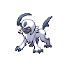  [Absol](#/pokemon/359)  20%           |   [Drifblim](#/pokemon/426)  20%  |   [Swellow](#/pokemon/277)  10%   |   [Lunatone](#/pokemon/337)  10% |   [Solrock](#/pokemon/338)  10%    | 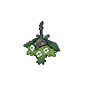  [Wormadam-plant](#/pokemon/413)  10% |
|                                                                               |   [Mothim](#/pokemon/414)  10%         | 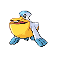  [Pelipper](#/pokemon/279)  10%  |
|  grass-doubles     |   [Golbat](#/pokemon/042)  20%         |   [Tangela](#/pokemon/114)  20%    |   [Nidorino](#/pokemon/033)  10% |   [Nidorina](#/pokemon/030)  10% |   [Yanma](#/pokemon/193)  10%        | 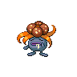  [Gloom](#/pokemon/044)  10%                   |
|                                                                               |   [Weepinbell](#/pokemon/070)  10% |   [Skiploom](#/pokemon/188)  10%  |
|  grass-special     |   [Audino](#/pokemon/531)  80%         | 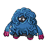  [Tangrowth](#/pokemon/465)  5% | 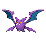  [Crobat](#/pokemon/169)  5%      |   [Nidoking](#/pokemon/034)  5%  |   [Nidoqueen](#/pokemon/031)  5% |
|  surf-normal           | 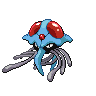  [Tentacruel](#/pokemon/073)  60% | 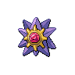  [Starmie](#/pokemon/121)  30%    |   [Kingdra](#/pokemon/230)  10%   |
|  surf-special        |   [Shellder](#/pokemon/090)  65%     | 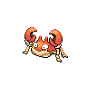  [Krabby](#/pokemon/098)  30%      |   [Luvdisc](#/pokemon/370)  5%    |
|  fishing-normal  |   [Shellder](#/pokemon/090)  60%     |   [Luvdisc](#/pokemon/370)  30%    | 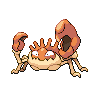  [Kingler](#/pokemon/099)  5%    | 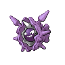  [Cloyster](#/pokemon/091)  5%  |
| legendary-encounter surf-special                                          | 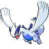  [Lugia](#/pokemon/249)  1%            |