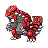

# Route 15

## Wild Encounters

| Area                                                                       | Pokemon                                                                                            | &nbsp;                                                                                       | &nbsp;                                                                                          | &nbsp;                                                                                         | &nbsp;                                                                                             | &nbsp;                                                                                            |
| -------------------------------------------------------------------------- | -------------------------------------------------------------------------------------------------- | -------------------------------------------------------------------------------------------- | ----------------------------------------------------------------------------------------------- | ---------------------------------------------------------------------------------------------- | -------------------------------------------------------------------------------------------------- | ------------------------------------------------------------------------------------------------- |
|  grass-normal     |   [Throh](#/pokemon/538)  20%           |   [Sawk](#/pokemon/539)  20%       |   [Tyrogue](#/pokemon/236)  10%    |   [Graveler](#/pokemon/075)  10% |   [Gabite](#/pokemon/444)  10%         |   [Pupitar](#/pokemon/247)  10%      |
|                                                                            |   [Kangaskhan](#/pokemon/115)  10% |   [Marowak](#/pokemon/105)  10% |
|  grass-doubles  |   [Machoke](#/pokemon/067)  20%       |   [Gurdurr](#/pokemon/533)  20% |   [Pupitar](#/pokemon/247)  10%    |   [Gligar](#/pokemon/207)  10%     |   [Kangaskhan](#/pokemon/115)  10% |   [Donphan](#/pokemon/232)  10%      |
|                                                                            |   [Ursaring](#/pokemon/217)  10%     |   [Marowak](#/pokemon/105)  10% |
|  grass-special  |   [Audino](#/pokemon/531)  70%         |   [Emolga](#/pokemon/587)  10%   |   [Tyranitar](#/pokemon/248)  5% |   [Gliscor](#/pokemon/472)  5%    |   [Machamp](#/pokemon/068)  5%        |   [Conkeldurr](#/pokemon/534)  5% |
| legendary-encounter grass-doubles                                      |   [Groudon](#/pokemon/383)  1%        |
