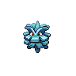
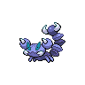
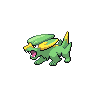
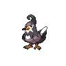
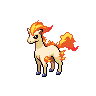
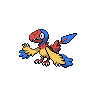
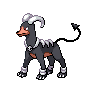
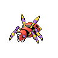

# Route 16

## Wild Encounters

| Area                                                                    | Pokemon                                                                                     | &nbsp;                                                                                        | &nbsp;                                                                                        | &nbsp;                                                                                           | &nbsp;                                                                                     | &nbsp;                                                                                   |
| ----------------------------------------------------------------------- | ------------------------------------------------------------------------------------------- | --------------------------------------------------------------------------------------------- | --------------------------------------------------------------------------------------------- | ------------------------------------------------------------------------------------------------ | ------------------------------------------------------------------------------------------ | ---------------------------------------------------------------------------------------- |
|  grass-normal  |   [Ekans](#/pokemon/023)  20%    |   [Pineco](#/pokemon/204)  20%    |   [Skorupi](#/pokemon/451)  10%  |   [Electrike](#/pokemon/309)  10% |   [Combee](#/pokemon/415)  10% |   [Paras](#/pokemon/046)  10% |
|                                                                         |   [Buneary](#/pokemon/427)  5% |   [Pawniard](#/pokemon/624)  5% |   [Drifloon](#/pokemon/425)  5% |   [Spoink](#/pokemon/325)  5%        |
## Trainers

| Trainer            | 1                                                                                                 | 2                                                                                                 |
| ------------------ | ------------------------------------------------------------------------------------------------- | ------------------------------------------------------------------------------------------------- |
| Cycling Hector     |   [Staravia](#/pokemon/397)  Lv. 30 |   [Ponyta](#/pokemon/077)  Lv. 30     |
| Backpacker Peter   |   [Klink](#/pokemon/599)  Lv. 30       |   [Prinplup](#/pokemon/394)  Lv. 30 |
| Cycling Krissa     |   [Archen](#/pokemon/566)  Lv. 30     |   [Grotle](#/pokemon/388)  Lv. 30     |
| Policeman Daniel   |   [Houndoom](#/pokemon/229)  Lv. 30 |   [Magmar](#/pokemon/126)  Lv. 30     |
| Backpacker Lora    |   [Cherrim](#/pokemon/421)  Lv. 30   |   [Monferno](#/pokemon/391)  Lv. 30 |
| Backpacker Stephen |   [Corphish](#/pokemon/341)  Lv. 30 |   [Ariados](#/pokemon/168)  Lv. 30   |
