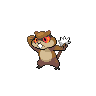
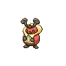
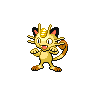

# Route 2

| Area                                                                       | Pokemon                                                                                         | &nbsp;                                                                                       | &nbsp;                                                                                           | &nbsp;                                                                                            | &nbsp;                                                                                        | &nbsp;                                                                                          |
| -------------------------------------------------------------------------- | ----------------------------------------------------------------------------------------------- | -------------------------------------------------------------------------------------------- | ------------------------------------------------------------------------------------------------ | ------------------------------------------------------------------------------------------------- | --------------------------------------------------------------------------------------------- | ----------------------------------------------------------------------------------------------- |
|  grass-normal     |   [Purrloin](#/pokemon/509)  20%  |   [Patrat](#/pokemon/504)  20%   |   [Kricketot](#/pokemon/401)  10% |   [Caterpie](#/pokemon/010)  10%    |   [Wurmple](#/pokemon/265)  10%  |   [Weedle](#/pokemon/013)  10%      |
|                                                                            |   [Poochyena](#/pokemon/261)  5% |   [Meowth](#/pokemon/052)  5%    |   [Spearow](#/pokemon/021)  5%      |   [Mankey](#/pokemon/056)  5%         |
|  grass-special  |   [Audino](#/pokemon/531)  60%      |   [Surskit](#/pokemon/283)  10% |   [Nincada](#/pokemon/290)  10%     |   [Butterfree](#/pokemon/012)  5% |   [Beedrill](#/pokemon/015)  5% |   [Beautifly](#/pokemon/267)  5% |
|                                                                            |   [Dustox](#/pokemon/269)  5%       |