# Route 3

## Wild Encounters

| Area                                                                             | Pokemon                                                                                         | &nbsp;                                                                                           | &nbsp;                                                                                           | &nbsp;                                                                                        | &nbsp;                                                                                     | &nbsp;                                                                                      |
| -------------------------------------------------------------------------------- | ----------------------------------------------------------------------------------------------- | ------------------------------------------------------------------------------------------------ | ------------------------------------------------------------------------------------------------ | --------------------------------------------------------------------------------------------- | ------------------------------------------------------------------------------------------ | ------------------------------------------------------------------------------------------- |
|  grass-normal           |   [Mareep](#/pokemon/179)  20%      |   [Taillow](#/pokemon/276)  20%     |   [Shellos](#/pokemon/422)  10%     |   [Sunkern](#/pokemon/191)  10%  |   [Lotad](#/pokemon/270)  10%   |   [Seedot](#/pokemon/273)  10%  |
|                                                                                  | 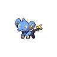  [Shinx](#/pokemon/403)  10%        |   [Abra](#/pokemon/063)  5%            |   [Phanpy](#/pokemon/231)  5%        |
|  grass-doubles        | 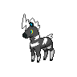  [Blitzle](#/pokemon/522)  20%    | 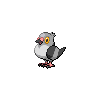  [Pidove](#/pokemon/519)  20%       |   [Growlithe](#/pokemon/058)  10% |   [Vulpix](#/pokemon/037)  10%    |   [Hoppip](#/pokemon/187)  10% |   [Budew](#/pokemon/406)  10%    |
|                                                                                  |   [Azumarill](#/pokemon/184)  5% |   [Houndour](#/pokemon/228)  5%    |   [Volbeat](#/pokemon/313)  4%      |   [Illumise](#/pokemon/314)  4% |   [Lombre](#/pokemon/271)  1%  |   [Nuzleaf](#/pokemon/274)  1% |
|  grass-special        |   [Audino](#/pokemon/531)  70%      |   [Oshawott](#/pokemon/501)  10%   |   [Squirtle](#/pokemon/007)  5%    |   [Totodile](#/pokemon/158)  5% |   [Mudkip](#/pokemon/258)  5%  |   [Piplup](#/pokemon/393)  5%   |
|  surf-normal              |   [Slowpoke](#/pokemon/079)  60%  |   [Psyduck](#/pokemon/054)  30%     |   [Marill](#/pokemon/183)  10%       |
|  surf-special           |   [Golduck](#/pokemon/055)  60%    |   [Azumarill](#/pokemon/184)  30% |   [Slowbro](#/pokemon/080)  5%      |   [Slowking](#/pokemon/199)  5% |
|  fishing-normal     | 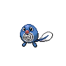  [Poliwag](#/pokemon/060)  60%    |   [Slowpoke](#/pokemon/079)  30%   |   [Chinchou](#/pokemon/170)  5%    |   [Remoraid](#/pokemon/223)  5% |
|  fishing-special  |   [Chinchou](#/pokemon/170)  60%  | 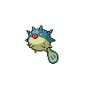  [Qwilfish](#/pokemon/211)  30%   |   [Remoraid](#/pokemon/223)  10%   |
## Trainers

| Trainer               | 1                                                                                                   | 2                                                                                                   | 3                                                                                               | 4                                                                                               | 5                                                                                             | 6                                                                                                 |
| --------------------- | --------------------------------------------------------------------------------------------------- | --------------------------------------------------------------------------------------------------- | ----------------------------------------------------------------------------------------------- | ----------------------------------------------------------------------------------------------- | --------------------------------------------------------------------------------------------- | ------------------------------------------------------------------------------------------------- |
| Kumi & Amy D          | 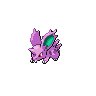  [Nidoran-m](#/pokemon/032)  Lv. 14 |   [Nidoran-f](#/pokemon/029)  Lv. 14 |
| Nursery Aide Autumn   | 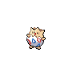  [Togepi](#/pokemon/175)  Lv. 14       |   [Natu](#/pokemon/177)  Lv. 14           |   [Ralts](#/pokemon/280)  Lv. 14     | 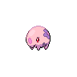  [Munna](#/pokemon/517)  Lv. 14     |
| Preschooler Doyle     |   [Squirtle](#/pokemon/007)  Lv. 14   |   [Oshawott](#/pokemon/501)  Lv. 14   |
| Preschooler Wendy     |   [Totodile](#/pokemon/158)  Lv. 14   |   [Piplup](#/pokemon/393)  Lv. 14       |
| Preschooler Tully     |   [Mudkip](#/pokemon/258)  Lv. 14       |   [Shellos](#/pokemon/422)  Lv. 14     |   [Psyduck](#/pokemon/054)  Lv. 14 |
| Pkmn Breeder Adelaide | 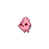  [Igglybuff](#/pokemon/174)  Lv. 12 | 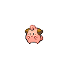  [Cleffa](#/pokemon/173)  Lv. 12       |   [Pichu](#/pokemon/172)  Lv. 12     |   [Magby](#/pokemon/240)  Lv. 12     | 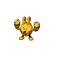  [Elekid](#/pokemon/239)  Lv. 12 |   [Smoochum](#/pokemon/238)  Lv. 12 |
| School Kid Al         |   [Blitzle](#/pokemon/522)  Lv. 15     |   [Mareep](#/pokemon/179)  Lv. 15       |   [Flaaffy](#/pokemon/180)  Lv. 15 |
| School Kid Marsha     |   [Phanpy](#/pokemon/231)  Lv. 15       |   [Teddiursa](#/pokemon/216)  Lv. 15 |   [Woobat](#/pokemon/527)  Lv. 15   |   [Whismur](#/pokemon/293)  Lv. 15 |
| School Kid Gina       |   [Wooper](#/pokemon/194)  Lv. 16       |   [Taillow](#/pokemon/276)  Lv. 16     |   [Lotad](#/pokemon/270)  Lv. 16     |   [Seedot](#/pokemon/273)  Lv. 16   |
| School Kid Edgar      |   [Shinx](#/pokemon/403)  Lv. 16         |   [Luxio](#/pokemon/404)  Lv. 16         |   [Nuzleaf](#/pokemon/274)  Lv. 16 |   [Lombre](#/pokemon/271)  Lv. 16   |
| Pkmn Breeder Galen    |   [Serperior](#/pokemon/497)  Lv. 50 |   [Samurott](#/pokemon/503)  Lv. 50   |   [Emboar](#/pokemon/500)  Lv. 50   |

=== "Fire"

    | Trainer                                                                             | 1                                                                                                 | 2                                                                                                     | 3                                                                                               | 4                                                                                                 |
    | ----------------------------------------------------------------------------------- | ------------------------------------------------------------------------------------------------- | ----------------------------------------------------------------------------------------------------- | ----------------------------------------------------------------------------------------------- | ------------------------------------------------------------------------------------------------- |
    | Cheren   |   [Staravia](#/pokemon/397)  Lv. 14 |   [Roggenrola](#/pokemon/524)  Lv. 14 |   [Pansage](#/pokemon/511)  Lv. 14 |   [Oshawott](#/pokemon/501)  Lv. 16 |

=== "Water"

    | Trainer                                                                             | 1                                                                                                 | 2                                                                                                     | 3                                                                                               | 4                                                                                           |
    | ----------------------------------------------------------------------------------- | ------------------------------------------------------------------------------------------------- | ----------------------------------------------------------------------------------------------------- | ----------------------------------------------------------------------------------------------- | ------------------------------------------------------------------------------------------- |
    | Cheren   |   [Staravia](#/pokemon/397)  Lv. 14 |   [Roggenrola](#/pokemon/524)  Lv. 14 |   [Pansear](#/pokemon/513)  Lv. 14 |   [Snivy](#/pokemon/495)  Lv. 16 |

=== "Grass"

    | Trainer                                                                             | 1                                                                                                 | 2                                                                                                     | 3                                                                                               | 4                                                                                           |
    | ----------------------------------------------------------------------------------- | ------------------------------------------------------------------------------------------------- | ----------------------------------------------------------------------------------------------------- | ----------------------------------------------------------------------------------------------- | ------------------------------------------------------------------------------------------- |
    | Cheren   |   [Staravia](#/pokemon/397)  Lv. 14 |   [Roggenrola](#/pokemon/524)  Lv. 14 |   [Panpour](#/pokemon/515)  Lv. 14 |   [Tepig](#/pokemon/498)  Lv. 16 |

 

## Cheren

=== "Fire"

    |                                | Item | Nature | Ability      | Moves                                                     |
    | ----------------------------------------------------------------------------------------------------- | ---- | ------ | ------------ | --------------------------------------------------------- |
    |   [Staravia](#/pokemon/397)  Lv. 14     | N/A  | N/A    | Reckless     | <ul><li>N/A</li><li>N/A</li><li>N/A</li><li>N/A</li></ul> |
    |   [Roggenrola](#/pokemon/524)  Lv. 14 | N/A  | N/A    | Sturdy       | <ul><li>N/A</li><li>N/A</li><li>N/A</li><li>N/A</li></ul> |
    |   [Pansage](#/pokemon/511)  Lv. 14       | N/A  | N/A    | Overgrow     | <ul><li>N/A</li><li>N/A</li><li>N/A</li><li>N/A</li></ul> |
    |   [Oshawott](#/pokemon/501)  Lv. 16     | N/A  | N/A    | Vital-Spirit | <ul><li>N/A</li><li>N/A</li><li>N/A</li><li>N/A</li></ul> |

=== "Water"

    |                                | Item | Nature | Ability  | Moves                                                     |
    | ----------------------------------------------------------------------------------------------------- | ---- | ------ | -------- | --------------------------------------------------------- |
    |   [Staravia](#/pokemon/397)  Lv. 14     | N/A  | N/A    | Reckless | <ul><li>N/A</li><li>N/A</li><li>N/A</li><li>N/A</li></ul> |
    |   [Roggenrola](#/pokemon/524)  Lv. 14 | N/A  | N/A    | Sturdy   | <ul><li>N/A</li><li>N/A</li><li>N/A</li><li>N/A</li></ul> |
    |   [Pansear](#/pokemon/513)  Lv. 14       | N/A  | N/A    | Blaze    | <ul><li>N/A</li><li>N/A</li><li>N/A</li><li>N/A</li></ul> |
    |   [Snivy](#/pokemon/495)  Lv. 16           | N/A  | N/A    | Contrary | <ul><li>N/A</li><li>N/A</li><li>N/A</li><li>N/A</li></ul> |

=== "Grass"

    |                                | Item | Nature | Ability      | Moves                                                     |
    | ----------------------------------------------------------------------------------------------------- | ---- | ------ | ------------ | --------------------------------------------------------- |
    |   [Staravia](#/pokemon/397)  Lv. 14     | N/A  | N/A    | Reckless     | <ul><li>N/A</li><li>N/A</li><li>N/A</li><li>N/A</li></ul> |
    |   [Roggenrola](#/pokemon/524)  Lv. 14 | N/A  | N/A    | Sturdy       | <ul><li>N/A</li><li>N/A</li><li>N/A</li><li>N/A</li></ul> |
    |   [Panpour](#/pokemon/515)  Lv. 14       | N/A  | N/A    | Torrent      | <ul><li>N/A</li><li>N/A</li><li>N/A</li><li>N/A</li></ul> |
    |   [Tepig](#/pokemon/498)  Lv. 16           | N/A  | N/A    | Adaptability | <ul><li>N/A</li><li>N/A</li><li>N/A</li><li>N/A</li></ul> |
