# Route 5

## Wild Encounters

| Area                                                                       | Pokemon                                                                                        | &nbsp;                                                                                         | &nbsp;                                                                                         | &nbsp;                                                                                           | &nbsp;                                                                                         | &nbsp;                                                                                         |
| -------------------------------------------------------------------------- | ---------------------------------------------------------------------------------------------- | ---------------------------------------------------------------------------------------------- | ---------------------------------------------------------------------------------------------- | ------------------------------------------------------------------------------------------------ | ---------------------------------------------------------------------------------------------- | ---------------------------------------------------------------------------------------------- |
|  grass-normal     |   [Solosis](#/pokemon/577)  20%   |   [Gothita](#/pokemon/574)  20%   |   [Koffing](#/pokemon/109)  10%   | 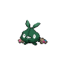  [Trubbish](#/pokemon/568)  10%   | 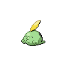  [Gulpin](#/pokemon/316)  10%     | 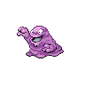  [Grimer](#/pokemon/088)  10%     |
|                                                                            |   [Ditto](#/pokemon/132)  5%        |   [Mime-jr](#/pokemon/439)  5%    | 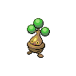  [Bonsly](#/pokemon/438)  5%      | 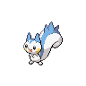  [Pachirisu](#/pokemon/417)  5%  |
|  grass-doubles  |   [Nidorina](#/pokemon/030)  20% |   [Nidorino](#/pokemon/033)  20% | 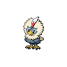  [Rufflet](#/pokemon/627)  10%   |   [Lickitung](#/pokemon/108)  10% |   [Smeargle](#/pokemon/235)  10% |   [Minccino](#/pokemon/572)  10% |
|                                                                            | 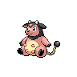  [Miltank](#/pokemon/241)  5%    |   [Tauros](#/pokemon/128)  5%      |   [Bagon](#/pokemon/371)  5%        |   [Munchlax](#/pokemon/446)  5%    |
|  grass-special  | 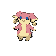  [Audino](#/pokemon/531)  60%     |   [Emolga](#/pokemon/587)  20%     | 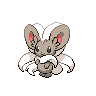  [Cinccino](#/pokemon/573)  10% |   [Nidoqueen](#/pokemon/031)  10% |   [Nidoking](#/pokemon/034)  10% |   [Braviary](#/pokemon/628)  10% |
## Trainers

| Trainer            | 1                                                                                                     | 2                                                                                                 | 3                                                                                                 |
| ------------------ | ----------------------------------------------------------------------------------------------------- | ------------------------------------------------------------------------------------------------- | ------------------------------------------------------------------------------------------------- |
| Preschooler Sarah  |   [Lunatone](#/pokemon/337)  Lv. 35     |
| Preschooler Billy  | 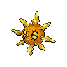  [Solrock](#/pokemon/338)  Lv. 35       |
| Baker Jenn         |   [Combee](#/pokemon/415)  Lv. 33         |
| Harlequin Paul     |   [Palpitoad](#/pokemon/536)  Lv. 32   | 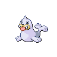  [Seel](#/pokemon/086)  Lv. 32         |
| Musician Preston   |   [Wigglytuff](#/pokemon/040)  Lv. 33 |
| Dancer Brian       | 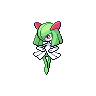  [Kirlia](#/pokemon/281)  Lv. 33         | 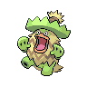  [Ludicolo](#/pokemon/272)  Lv. 33 |
| Artist Horton      |   [Smeargle](#/pokemon/235)  Lv. 31     |   [Smeargle](#/pokemon/235)  Lv. 31 |   [Smeargle](#/pokemon/235)  Lv. 31 |
| Backpacker Michael |   [Nosepass](#/pokemon/299)  Lv. 33     |
| Backpacker Lois    | 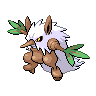  [Shiftry](#/pokemon/275)  Lv. 33       |

=== "Fire"

    | Trainer                                                                             | 1                                                                                                   | 2                                                                                                 | 3                                                                                                 | 4                                                                                                 | 5                                                                                                 |
    | ----------------------------------------------------------------------------------- | --------------------------------------------------------------------------------------------------- | ------------------------------------------------------------------------------------------------- | ------------------------------------------------------------------------------------------------- | ------------------------------------------------------------------------------------------------- | ------------------------------------------------------------------------------------------------- |
    | Cheren   | 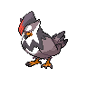  [Staraptor](#/pokemon/398)  Lv. 36 |   [Gigalith](#/pokemon/526)  Lv. 36 |   [Alakazam](#/pokemon/065)  Lv. 36 | 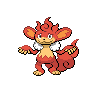  [Simisear](#/pokemon/514)  Lv. 36 |   [Samurott](#/pokemon/503)  Lv. 38 |

=== "Grass"

    | Trainer                                                                             | 1                                                                                                   | 2                                                                                                 | 3                                                                                                 | 4                                                                                                 | 5                                                                                             |
    | ----------------------------------------------------------------------------------- | --------------------------------------------------------------------------------------------------- | ------------------------------------------------------------------------------------------------- | ------------------------------------------------------------------------------------------------- | ------------------------------------------------------------------------------------------------- | --------------------------------------------------------------------------------------------- |
    | Cheren   |   [Staraptor](#/pokemon/398)  Lv. 36 |   [Gigalith](#/pokemon/526)  Lv. 36 |   [Alakazam](#/pokemon/065)  Lv. 36 | 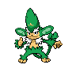  [Simisage](#/pokemon/512)  Lv. 36 |   [Emboar](#/pokemon/500)  Lv. 38 |

=== "Water"

    | Trainer                                                                             | 1                                                                                                   | 2                                                                                                 | 3                                                                                                 | 4                                                                                                 | 5                                                                                                   |
    | ----------------------------------------------------------------------------------- | --------------------------------------------------------------------------------------------------- | ------------------------------------------------------------------------------------------------- | ------------------------------------------------------------------------------------------------- | ------------------------------------------------------------------------------------------------- | --------------------------------------------------------------------------------------------------- |
    | Cheren   |   [Staraptor](#/pokemon/398)  Lv. 36 |   [Gigalith](#/pokemon/526)  Lv. 36 |   [Alakazam](#/pokemon/065)  Lv. 36 |   [Simipour](#/pokemon/516)  Lv. 36 | 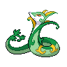  [Serperior](#/pokemon/497)  Lv. 38 |

 

## Cheren

=== "Fire"

    |                              | Item                                                                    | Nature | Ability      | Moves                                                     |
    | --------------------------------------------------------------------------------------------------- | ----------------------------------------------------------------------- | ------ | ------------ | --------------------------------------------------------- |
    |   [Staraptor](#/pokemon/398)  Lv. 36 | 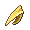   Sharp beak          | N/A    | Reckless     | <ul><li>N/A</li><li>N/A</li><li>N/A</li><li>N/A</li></ul> |
    |   [Gigalith](#/pokemon/526)  Lv. 36   | 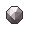   Hard stone          | N/A    | Sturdy       | <ul><li>N/A</li><li>N/A</li><li>N/A</li><li>N/A</li></ul> |
    |   [Alakazam](#/pokemon/065)  Lv. 36   | 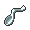   Twisted spoon | N/A    | Magic-Guard  | <ul><li>N/A</li><li>N/A</li><li>N/A</li><li>N/A</li></ul> |
    |   [Simisear](#/pokemon/514)  Lv. 36   | 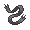   Expert belt       | N/A    | Blaze        | <ul><li>N/A</li><li>N/A</li><li>N/A</li><li>N/A</li></ul> |
    |   [Samurott](#/pokemon/503)  Lv. 38   | 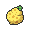   Sitrus berry    | N/A    | Vital-Spirit | <ul><li>N/A</li><li>N/A</li><li>N/A</li><li>N/A</li></ul> |

=== "Grass"

    |                              | Item                                                                    | Nature | Ability      | Moves                                                     |
    | --------------------------------------------------------------------------------------------------- | ----------------------------------------------------------------------- | ------ | ------------ | --------------------------------------------------------- |
    |   [Staraptor](#/pokemon/398)  Lv. 36 |    Sharp beak          | N/A    | Reckless     | <ul><li>N/A</li><li>N/A</li><li>N/A</li><li>N/A</li></ul> |
    |   [Gigalith](#/pokemon/526)  Lv. 36   |    Hard stone          | N/A    | Sturdy       | <ul><li>N/A</li><li>N/A</li><li>N/A</li><li>N/A</li></ul> |
    |   [Alakazam](#/pokemon/065)  Lv. 36   |    Twisted spoon | N/A    | Magic-Guard  | <ul><li>N/A</li><li>N/A</li><li>N/A</li><li>N/A</li></ul> |
    |   [Simisage](#/pokemon/512)  Lv. 36   |    Expert belt       | N/A    | Overgrow     | <ul><li>N/A</li><li>N/A</li><li>N/A</li><li>N/A</li></ul> |
    |   [Emboar](#/pokemon/500)  Lv. 38       |    Sitrus berry    | N/A    | Adaptability | <ul><li>N/A</li><li>N/A</li><li>N/A</li><li>N/A</li></ul> |

=== "Water"

    |                              | Item                                                                    | Nature | Ability     | Moves                                                     |
    | --------------------------------------------------------------------------------------------------- | ----------------------------------------------------------------------- | ------ | ----------- | --------------------------------------------------------- |
    |   [Staraptor](#/pokemon/398)  Lv. 36 |    Sharp beak          | N/A    | Reckless    | <ul><li>N/A</li><li>N/A</li><li>N/A</li><li>N/A</li></ul> |
    |   [Gigalith](#/pokemon/526)  Lv. 36   |    Hard stone          | N/A    | Sturdy      | <ul><li>N/A</li><li>N/A</li><li>N/A</li><li>N/A</li></ul> |
    |   [Alakazam](#/pokemon/065)  Lv. 36   |    Twisted spoon | N/A    | Magic-Guard | <ul><li>N/A</li><li>N/A</li><li>N/A</li><li>N/A</li></ul> |
    |   [Simipour](#/pokemon/516)  Lv. 36   |    Expert belt       | N/A    | Torrent     | <ul><li>N/A</li><li>N/A</li><li>N/A</li><li>N/A</li></ul> |
    |   [Serperior](#/pokemon/497)  Lv. 38 |    Sitrus berry    | N/A    | Contrary    | <ul><li>N/A</li><li>N/A</li><li>N/A</li><li>N/A</li></ul> |
