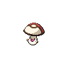
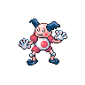
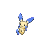
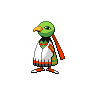
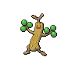

# Route 6 - Spring|Summer|Autumn

## Wild Encounters

| Area                                                                             | Pokemon                                                                                        | &nbsp;                                                                                          | &nbsp;                                                                                         | &nbsp;                                                                                       | &nbsp;                                                                                           | &nbsp;                                                                                 |
| -------------------------------------------------------------------------------- | ---------------------------------------------------------------------------------------------- | ----------------------------------------------------------------------------------------------- | ---------------------------------------------------------------------------------------------- | -------------------------------------------------------------------------------------------- | ------------------------------------------------------------------------------------------------ | -------------------------------------------------------------------------------------- |
|  grass-normal           |   [Cherubi](#/pokemon/420)  20%   |   [Deerling](#/pokemon/585)  20%  |   [Stantler](#/pokemon/234)  10% |   [Foongus](#/pokemon/590)  10% |   [Pidgeotto](#/pokemon/017)  10% |   [Natu](#/pokemon/177)  10% |
|                                                                                  |   [Mr-mime](#/pokemon/122)  5%    |   [Bonsly](#/pokemon/438)  5%       |   [Plusle](#/pokemon/311)  5%      |   [Minun](#/pokemon/312)  5%      |
|  grass-doubles        |   [Cherrim](#/pokemon/421)  20%   |   [Sawsbuck](#/pokemon/586)  20%  |   [Stantler](#/pokemon/234)  10% |   [Foongus](#/pokemon/590)  10% |   [Pidgeotto](#/pokemon/017)  10% |   [Xatu](#/pokemon/178)  10% |
|                                                                                  |   [Mr-mime](#/pokemon/122)  5%    |   [Sudowoodo](#/pokemon/185)  5% |   [Plusle](#/pokemon/311)  5%      |   [Minun](#/pokemon/312)  5%      |
|  surf-normal              |   [Finneon](#/pokemon/456)  60%   |   [Goldeen](#/pokemon/118)  30%    |   [Chinchou](#/pokemon/170)  10% |
|  surf-special           |   [Lumineon](#/pokemon/457)  60% |   [Lanturn](#/pokemon/171)  30%    |   [Seaking](#/pokemon/119)  10%   |
|  fishing-normal     |   [Finneon](#/pokemon/456)  60%   |   [Chinchou](#/pokemon/170)  40%  |
|  fishing-special  |   [Lumineon](#/pokemon/457)  60% |   [Lanturn](#/pokemon/171)  40%    |
## Trainers

| Trainer             | 1                                                                                                   | 2                                                                                                     | 3                                                                                                 |
| ------------------- | --------------------------------------------------------------------------------------------------- | ----------------------------------------------------------------------------------------------------- | ------------------------------------------------------------------------------------------------- |
| Scientist William   |   [Sawsbuck](#/pokemon/586)  Lv. 36   |
| Pkmn Ranger Shanti  |   [Emolga](#/pokemon/587)  Lv. 35       |   [Whimsicott](#/pokemon/547)  Lv. 35 |
| Parasol Lady Nicole |   [Lilligant](#/pokemon/549)  Lv. 34 |   [Alomomola](#/pokemon/594)  Lv. 34   |   [Jumpluff](#/pokemon/189)  Lv. 34 |
| Scientist Maria     |   [Gastrodon](#/pokemon/423)  Lv. 34 |   [Ninetales](#/pokemon/038)  Lv. 34   |   [Parasect](#/pokemon/047)  Lv. 34 |
| Scientist Ron       |   [Magneton](#/pokemon/082)  Lv. 34   |   [Electrode](#/pokemon/101)  Lv. 34   |   [Politoed](#/pokemon/186)  Lv. 34 |
| Parasol Lady Tihana |   [Corsola](#/pokemon/222)  Lv. 34     |   [Tropius](#/pokemon/357)  Lv. 34       |   [Milotic](#/pokemon/350)  Lv. 34   |
| Pkmn Ranger Richard |   [Pignite](#/pokemon/499)  Lv. 34     |   [Sealeo](#/pokemon/364)  Lv. 34         |   [Leavanny](#/pokemon/542)  Lv. 34 |
