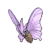
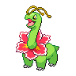

# Route 7

## Wild Encounters

| Area                                                                       | Pokemon                                                                                        | &nbsp;                                                                                            | &nbsp;                                                                                       | &nbsp;                                                                                       | &nbsp;                                                                                     | &nbsp;                                                                                       |
| -------------------------------------------------------------------------- | ---------------------------------------------------------------------------------------------- | ------------------------------------------------------------------------------------------------- | -------------------------------------------------------------------------------------------- | -------------------------------------------------------------------------------------------- | ------------------------------------------------------------------------------------------ | -------------------------------------------------------------------------------------------- |
|  grass-normal     |   [Ponyta](#/pokemon/077)  20%     |   [Aipom](#/pokemon/190)  20%          |   [Magby](#/pokemon/240)  10%     |   [Nincada](#/pokemon/290)  10% |   [Doduo](#/pokemon/084)  10%   |   [Cubone](#/pokemon/104)  10%   |
|                                                                            |   [Skarmory](#/pokemon/227)  5%  |   [Pachirisu](#/pokemon/417)  5%   |   [Torkoal](#/pokemon/324)  5%  |   [Gligar](#/pokemon/207)  5%    |
|  grass-doubles  |   [Rapidash](#/pokemon/078)  20% |   [Ambipom](#/pokemon/424)  20%      |   [Magmar](#/pokemon/126)  10%   |   [Ninjask](#/pokemon/291)  10% |   [Dodrio](#/pokemon/085)  10% |   [Marowak](#/pokemon/105)  10% |
|                                                                            |   [Heatmor](#/pokemon/631)  5%    |   [Bouffalant](#/pokemon/626)  5% |   [Miltank](#/pokemon/241)  5%  |   [Tauros](#/pokemon/128)  5%    |
|  grass-special  |   [Audino](#/pokemon/531)  60%     |   [Emolga](#/pokemon/587)  30%        |   [Gliscor](#/pokemon/472)  10% |
## Trainers

| Trainer             | 1                                                                                                                       | 2                                                                                                   | 3                                                                                                   |
| ------------------- | ----------------------------------------------------------------------------------------------------------------------- | --------------------------------------------------------------------------------------------------- | --------------------------------------------------------------------------------------------------- |
| Youngster Mikey     |   [Tauros](#/pokemon/128)  Lv. 44                           |   [Hitmonlee](#/pokemon/106)  Lv. 44 |   [Stoutland](#/pokemon/508)  Lv. 44 |
| Youngster Parker    |   [Darmanitan-standard](#/pokemon/555)  Lv. 44 |   [Accelgor](#/pokemon/617)  Lv. 44   |   [Breloom](#/pokemon/286)  Lv. 44     |
| Backpacker Terrance |   [Grumpig](#/pokemon/326)  Lv. 45                         |   [Huntail](#/pokemon/367)  Lv. 45     |
| Ace Trainer Elmer   |   [Venusaur](#/pokemon/003)  Lv. 45                       |   [Charizard](#/pokemon/006)  Lv. 45 |   [Blastoise](#/pokemon/009)  Lv. 45 |
| Backpacker Ruth     |   [Venomoth](#/pokemon/049)  Lv. 45                       |   [Rapidash](#/pokemon/078)  Lv. 45   |
| Pkmn Ranger Mary    |   [Stantler](#/pokemon/234)  Lv. 44                       |   [Ambipom](#/pokemon/424)  Lv. 44     |   [Altaria](#/pokemon/334)  Lv. 44     |
| Pkmn Ranger Pedro   |   [Deino](#/pokemon/633)  Lv. 45                             |   [Heatmor](#/pokemon/631)  Lv. 45     |
| Harlequin Ian       |   [Clefable](#/pokemon/036)  Lv. 44                       |   [Dodrio](#/pokemon/085)  Lv. 44       |   [Golduck](#/pokemon/055)  Lv. 44     |
| Harlequin Pat       |   [Victreebel](#/pokemon/071)  Lv. 44                   |   [Hitmontop](#/pokemon/237)  Lv. 44 |   [Meganium](#/pokemon/154)  Lv. 44   |
