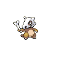
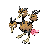

# Route 7

| Area                                                                       | Pokemon                                                                                        | &nbsp;                                                                                            | &nbsp;                                                                                       | &nbsp;                                                                                       | &nbsp;                                                                                     | &nbsp;                                                                                       |
| -------------------------------------------------------------------------- | ---------------------------------------------------------------------------------------------- | ------------------------------------------------------------------------------------------------- | -------------------------------------------------------------------------------------------- | -------------------------------------------------------------------------------------------- | ------------------------------------------------------------------------------------------ | -------------------------------------------------------------------------------------------- |
|  grass-normal     |   [Ponyta](#/pokemon/077)  20%     |   [Aipom](#/pokemon/190)  20%          |   [Magby](#/pokemon/240)  10%     |   [Nincada](#/pokemon/290)  10% |   [Doduo](#/pokemon/084)  10%   |   [Cubone](#/pokemon/104)  10%   |
|                                                                            |   [Skarmory](#/pokemon/227)  5%  |   [Pachirisu](#/pokemon/417)  5%   |   [Torkoal](#/pokemon/324)  5%  |   [Gligar](#/pokemon/207)  5%    |
|  grass-doubles  |   [Rapidash](#/pokemon/078)  20% |   [Ambipom](#/pokemon/424)  20%      |   [Magmar](#/pokemon/126)  10%   |   [Ninjask](#/pokemon/291)  10% |   [Dodrio](#/pokemon/085)  10% |   [Marowak](#/pokemon/105)  10% |
|                                                                            |   [Heatmor](#/pokemon/631)  5%    |   [Bouffalant](#/pokemon/626)  5% |   [Miltank](#/pokemon/241)  5%  |   [Tauros](#/pokemon/128)  5%    |
|  grass-special  |   [Audino](#/pokemon/531)  60%     |   [Emolga](#/pokemon/587)  30%        |   [Gliscor](#/pokemon/472)  10% |