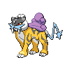
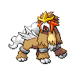
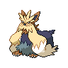
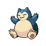

# Route 9

## Wild Encounters

| Area                                                                       | Pokemon                                                                                          | &nbsp;                                                                                            | &nbsp;                                                                                          | &nbsp;                                                                                         | &nbsp;                                                                                         | &nbsp;                                                                                         |
| -------------------------------------------------------------------------- | ------------------------------------------------------------------------------------------------ | ------------------------------------------------------------------------------------------------- | ----------------------------------------------------------------------------------------------- | ---------------------------------------------------------------------------------------------- | ---------------------------------------------------------------------------------------------- | ---------------------------------------------------------------------------------------------- |
|  grass-normal     |   [Gothorita](#/pokemon/575)  20% |   [Duosion](#/pokemon/578)  20%      |   [Kirlia](#/pokemon/281)  10%      |   [Minccino](#/pokemon/572)  10% |   [Pawniard](#/pokemon/624)  10% |   [Skitty](#/pokemon/300)  10%     |
|                                                                            |   [Liepard](#/pokemon/510)  10%     |   [Persian](#/pokemon/053)  10%      |
|  grass-doubles  |   [Flaaffy](#/pokemon/180)  20%     |   [Luxio](#/pokemon/404)  20%          |   [Hypno](#/pokemon/097)  10%        |   [Cinccino](#/pokemon/573)  10% |   [Bisharp](#/pokemon/625)  10%   |   [Garbodor](#/pokemon/569)  10% |
|                                                                            |   [Houndoom](#/pokemon/229)  10%   |   [Granbull](#/pokemon/210)  10%    |
|  grass-special  |   [Audino](#/pokemon/531)  90%       |   [Gothitelle](#/pokemon/576)  5% |   [Reuniclus](#/pokemon/579)  5% |
| legendary-encounter grass-special                                      |   [Raikou](#/pokemon/243)  1%        |   [Entei](#/pokemon/244)  1%           |
## Trainers

| Trainer             | 1                                                                                                     | 2                                                                                                     | 3                                                                                                 |
| ------------------- | ----------------------------------------------------------------------------------------------------- | ----------------------------------------------------------------------------------------------------- | ------------------------------------------------------------------------------------------------- |
| Roughneck Reesse    |   [Scrafty](#/pokemon/560)  Lv. 61       |   [Garbodor](#/pokemon/569)  Lv. 61     |
| Biker Philip        |   [Bouffalant](#/pokemon/626)  Lv. 62 |
| Hooligans Jim & Cas |   [Cacturne](#/pokemon/332)  Lv. 61     |   [Shiftry](#/pokemon/275)  Lv. 61       |
| Biker Zeke          |   [Pawniard](#/pokemon/624)  Lv. 61     |   [Bisharp](#/pokemon/625)  Lv. 61       |
| Roughneck Chance    |   [Chansey](#/pokemon/113)  Lv. 62       |
| Waitress Flo        |   [Clefable](#/pokemon/036)  Lv. 61     |   [Lilligant](#/pokemon/549)  Lv. 61   |   [Gorebyss](#/pokemon/368)  Lv. 61 |
| Rich Boy Manuel     |   [Arcanine](#/pokemon/059)  Lv. 61     |   [Raichu](#/pokemon/026)  Lv. 61         |   [Grumpig](#/pokemon/326)  Lv. 61   |
| Waiter Bert         |   [Simisage](#/pokemon/512)  Lv. 61     |   [Chandelure](#/pokemon/609)  Lv. 61 |   [Politoed](#/pokemon/186)  Lv. 61 |
| Lady Isabel         |   [Stoutland](#/pokemon/508)  Lv. 61   |   [Gengar](#/pokemon/094)  Lv. 61         |   [Snorlax](#/pokemon/143)  Lv. 61   |
