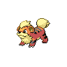
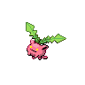
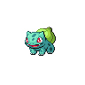
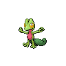
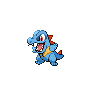
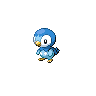
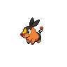
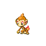
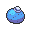

# Striaton city gym

| Trainer                                                                                        | 1                                                                                                 | 2                                                                                                     | 3                                                                                                   | 4                                                                                               | 5                                                                                                 | 6                                                                                               |
| ---------------------------------------------------------------------------------------------- | ------------------------------------------------------------------------------------------------- | ----------------------------------------------------------------------------------------------------- | --------------------------------------------------------------------------------------------------- | ----------------------------------------------------------------------------------------------- | ------------------------------------------------------------------------------------------------- | ----------------------------------------------------------------------------------------------- |
| Waiter Maxwell                                                                                 |   [Slowpoke](#/pokemon/079)  Lv. 11 |   [Growlithe](#/pokemon/058)  Lv. 11   |   [Budew](#/pokemon/406)  Lv. 11         |
| Waitres Tia                                                                                    |   [Hoppip](#/pokemon/187)  Lv. 12     |   [Slugma](#/pokemon/218)  Lv. 12         |   [Marill](#/pokemon/183)  Lv. 12       |
| Leader Cilan   |   [Snivy](#/pokemon/495)  Lv. 12       |   [Bulbasaur](#/pokemon/001)  Lv. 12   |   [Chikorita](#/pokemon/152)  Lv. 12 |   [Treecko](#/pokemon/252)  Lv. 12 |   [Turtwig](#/pokemon/387)  Lv. 12   |   [Pansage](#/pokemon/511)  Lv. 14 |
| Leader Cress   |   [Oshawott](#/pokemon/501)  Lv. 12 |   [Squirtle](#/pokemon/007)  Lv. 12     |   [Totodile](#/pokemon/158)  Lv. 12   |   [Mudkip](#/pokemon/258)  Lv. 12   |   [Piplup](#/pokemon/393)  Lv. 12     |   [Panpour](#/pokemon/515)  Lv. 14 |
| Leader Chili   |   [Tepig](#/pokemon/498)  Lv. 12       |   [Charmander](#/pokemon/004)  Lv. 12 |   [Cyndaquil](#/pokemon/155)  Lv. 12 |   [Torchic](#/pokemon/255)  Lv. 12 |   [Chimchar](#/pokemon/390)  Lv. 12 |   [Pansear](#/pokemon/513)  Lv. 12 |

## Leader Cilan

|                         | Item                                                           | Nature | Ability  | Moves                                                                                    |
| --------------------------------------------------------------------------------------------------- | -------------------------------------------------------------- | ------ | -------- | ---------------------------------------------------------------------------------------- |
|   [Snivy](#/pokemon/495)  Lv. 12         | N/A                                                            | N/A    | Overgrow | <ul><li>Tackle</li><li>Growth</li><li>Magical-Leaf</li><li>Twister</li></ul>             |
|   [Bulbasaur](#/pokemon/001)  Lv. 12 | N/A                                                            | N/A    | Overgrow | <ul><li>Secret-Power</li><li>Sleep-Powder</li><li>Leech-Seed</li><li>Vine-Whip</li></ul> |
|   [Chikorita](#/pokemon/152)  Lv. 12 | N/A                                                            | N/A    | Overgrow | <ul><li>Wring-Out</li><li>Synthesis</li><li>Razor-Leaf</li><li>Poison-Powder</li></ul>   |
|   [Treecko](#/pokemon/252)  Lv. 12     | N/A                                                            | N/A    | Overgrow | <ul><li>Grass-Whistle</li><li>Leech-Seed</li><li>Absorb</li><li>Quick-Attack</li></ul>   |
|   [Turtwig](#/pokemon/387)  Lv. 12     | N/A                                                            | N/A    | Overgrow | <ul><li>Tackle</li><li>Tickle</li><li>Razor-Leaf</li><li>Stealth-Rock</li></ul>          |
|   [Pansage](#/pokemon/511)  Lv. 14     |    Oran berry | N/A    | Gluttony | <ul><li>Work-Up</li><li>Bite</li><li>Magical-Leaf</li><li>Protect</li></ul>              |

## Leader Cress

|                       | Item                                                           | Nature | Ability  | Moves                                                                           |
| ------------------------------------------------------------------------------------------------- | -------------------------------------------------------------- | ------ | -------- | ------------------------------------------------------------------------------- |
|   [Oshawott](#/pokemon/501)  Lv. 12 | N/A                                                            | N/A    | Torrent  | <ul><li>Tackle</li><li>Screech</li><li>Brine</li><li>Air-Slash</li></ul>        |
|   [Squirtle](#/pokemon/007)  Lv. 12 | N/A                                                            | N/A    | Torrent  | <ul><li>Tackle</li><li>Iron-Defense</li><li>Aqua-Jet</li><li>Fake-Out</li></ul> |
|   [Totodile](#/pokemon/158)  Lv. 12 | N/A                                                            | N/A    | Torrent  | <ul><li>Scratch</li><li>Dragon-Dance</li><li>Aqua-Jet</li><li>Bite</li></ul>    |
|   [Mudkip](#/pokemon/258)  Lv. 12     | N/A                                                            | N/A    | Torrent  | <ul><li>Tackle</li><li>Ice-Ball</li><li>Mud-Bomb</li><li>Water-Gun</li></ul>    |
|   [Piplup](#/pokemon/393)  Lv. 12     | N/A                                                            | N/A    | Torrent  | <ul><li>Pound</li><li>Icy-Wind</li><li>Bubble-Beam</li><li>Pluck</li></ul>      |
|   [Panpour](#/pokemon/515)  Lv. 14   |    Oran berry | N/A    | Gluttony | <ul><li>Nasty-Plot</li><li>Bite</li><li>Water-Gun</li><li>Protect</li></ul>     |

## Leader Chili

|                           | Item                                                           | Nature | Ability  | Moves                                                                                       |
| ----------------------------------------------------------------------------------------------------- | -------------------------------------------------------------- | ------ | -------- | ------------------------------------------------------------------------------------------- |
|   [Tepig](#/pokemon/498)  Lv. 12           | N/A                                                            | N/A    | Blaze    | <ul><li>Tackle</li><li>Yawn</li><li>Ember</li><li>Magnitude</li></ul>                       |
|   [Charmander](#/pokemon/004)  Lv. 12 | N/A                                                            | N/A    | Blaze    | <ul><li>Scratch</li><li>Dragon-Dance</li><li>Ember</li><li>Smokescreen</li></ul>            |
|   [Cyndaquil](#/pokemon/155)  Lv. 12   | N/A                                                            | N/A    | Blaze    | <ul><li>Quick-Attack</li><li>Nature-Power</li><li>Smokescreen</li><li>Flame-Burst</li></ul> |
|   [Torchic](#/pokemon/255)  Lv. 12       | N/A                                                            | N/A    | Blaze    | <ul><li>Low-Kick</li><li>Focus-Energy</li><li>Ember</li><li>Feather-Dance</li></ul>         |
|   [Chimchar](#/pokemon/390)  Lv. 12     | N/A                                                            | N/A    | Blaze    | <ul><li>Assist</li><li>Fake-Out</li><li>Ember</li><li>Torment</li></ul>                     |
|   [Pansear](#/pokemon/513)  Lv. 12       |    Oran berry | N/A    | Gluttony | <ul><li>Nasty-Plot</li><li>Bite</li><li>Incinerate</li><li>Protect</li></ul>                |