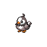

# Striaton city

## Wild Encounters

| Area                                                                             | Pokemon                                                                                                                | &nbsp;                                                                                         | &nbsp;                                                                                     |
| -------------------------------------------------------------------------------- | ---------------------------------------------------------------------------------------------------------------------- | ---------------------------------------------------------------------------------------------- | ------------------------------------------------------------------------------------------ |
|  surf-normal              |   [Marill](#/pokemon/183)  100%                            |
|  surf-special           |   [Azumarill](#/pokemon/184)  100%                      |
|  fishing-normal     |   [Psyduck](#/pokemon/054)  60%                           |   [Slowpoke](#/pokemon/079)  30% |   [Staryu](#/pokemon/120)  10% |
|  fishing-special  |   [Basculin-red-striped](#/pokemon/550)  60% |   [Staryu](#/pokemon/120)  40%     |
## Trainers

=== "Fire"

    | Trainer                                                                             | 1                                                                                             | 2                                                                                                 |
    | ----------------------------------------------------------------------------------- | --------------------------------------------------------------------------------------------- | ------------------------------------------------------------------------------------------------- |
    | Cheren   |   [Starly](#/pokemon/396)  Lv. 11 |   [Oshawott](#/pokemon/501)  Lv. 12 |

=== "Water"

    | Trainer                                                                             | 1                                                                                             | 2                                                                                           |
    | ----------------------------------------------------------------------------------- | --------------------------------------------------------------------------------------------- | ------------------------------------------------------------------------------------------- |
    | Cheren   |   [Starly](#/pokemon/396)  Lv. 11 |   [Snivy](#/pokemon/495)  Lv. 12 |

=== "Grass"

    | Trainer                                                                             | 1                                                                                             | 2                                                                                           |
    | ----------------------------------------------------------------------------------- | --------------------------------------------------------------------------------------------- | ------------------------------------------------------------------------------------------- |
    | Cheren   |   [Starly](#/pokemon/396)  Lv. 11 |   [Tepig](#/pokemon/498)  Lv. 12 |

 

## Cheren

=== "Fire"

    |                            | Item                                                           | Nature | Ability      | Moves                                                     |
    | ------------------------------------------------------------------------------------------------- | -------------------------------------------------------------- | ------ | ------------ | --------------------------------------------------------- |
    |   [Starly](#/pokemon/396)  Lv. 11     | N/A                                                            | N/A    | Keen-Eye     | <ul><li>N/A</li><li>N/A</li><li>N/A</li><li>N/A</li></ul> |
    |   [Oshawott](#/pokemon/501)  Lv. 12 |    Oran berry | N/A    | Vital-Spirit | <ul><li>N/A</li><li>N/A</li><li>N/A</li><li>N/A</li></ul> |

=== "Water"

    |                        | Item                                                           | Nature | Ability  | Moves                                                     |
    | --------------------------------------------------------------------------------------------- | -------------------------------------------------------------- | ------ | -------- | --------------------------------------------------------- |
    |   [Starly](#/pokemon/396)  Lv. 11 | N/A                                                            | N/A    | Keen-Eye | <ul><li>N/A</li><li>N/A</li><li>N/A</li><li>N/A</li></ul> |
    |   [Snivy](#/pokemon/495)  Lv. 12   |    Oran berry | N/A    | Contrary | <ul><li>N/A</li><li>N/A</li><li>N/A</li><li>N/A</li></ul> |

=== "Grass"

    |                        | Item                                                           | Nature | Ability      | Moves                                                     |
    | --------------------------------------------------------------------------------------------- | -------------------------------------------------------------- | ------ | ------------ | --------------------------------------------------------- |
    |   [Starly](#/pokemon/396)  Lv. 11 | N/A                                                            | N/A    | Keen-Eye     | <ul><li>N/A</li><li>N/A</li><li>N/A</li><li>N/A</li></ul> |
    |   [Tepig](#/pokemon/498)  Lv. 12   |    Oran berry | N/A    | Adaptability | <ul><li>N/A</li><li>N/A</li><li>N/A</li><li>N/A</li></ul> |
