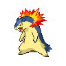

# Twist mountain - not 1f

| Trainer            | 1                                                                                                   | 2                                                                                                                       | 3                                                                                                   |
| ------------------ | --------------------------------------------------------------------------------------------------- | ----------------------------------------------------------------------------------------------------------------------- | --------------------------------------------------------------------------------------------------- |
| Black Belt Teppei  |   [Machamp](#/pokemon/068)  Lv. 54     |
| Worker Rich        |   [Glalie](#/pokemon/362)  Lv. 53       |   [Kangaskhan](#/pokemon/115)  Lv. 53                   |
| Worker Rob         |   [Metang](#/pokemon/375)  Lv. 54       |   [Toxicroak](#/pokemon/454)  Lv. 54                     |   [Medicham](#/pokemon/308)  Lv. 54   |
| Worker Cairn       |   [Excadrill](#/pokemon/530)  Lv. 53 |   [Hariyama](#/pokemon/297)  Lv. 53                       |   [Dugtrio](#/pokemon/051)  Lv. 53     |
| Doctor Hank        |   [Jynx](#/pokemon/124)  Lv. 53           |   [Mr-mime](#/pokemon/122)  Lv. 53                         |   [Wobbuffet](#/pokemon/202)  Lv. 53 |
| Hiker Neil         |   [Boldore](#/pokemon/525)  Lv. 52     |   [Probopass](#/pokemon/476)  Lv. 52                     |   [Gigalith](#/pokemon/526)  Lv. 52   |
| Hiker Darrell      |   [Sudowoodo](#/pokemon/185)  Lv. 52 |   [Golbat](#/pokemon/042)  Lv. 52                           |   [Crustle](#/pokemon/558)  Lv. 52     |
| Battle Girl Sharon |   [Mienshao](#/pokemon/620)  Lv. 54   |   [Breloom](#/pokemon/286)  Lv. 54                         |
| Ace Trainer Caroll |   [Gorebyss](#/pokemon/368)  Lv. 55   |   [Typhlosion](#/pokemon/157)  Lv. 55                   |   [Scizor](#/pokemon/212)  Lv. 55       |
| Worker Brand       |   [Sandslash](#/pokemon/028)  Lv. 53 |   [Swoobat](#/pokemon/528)  Lv. 53                         |
| Worker Heath       |   [Machoke](#/pokemon/067)  Lv. 53     |   [Darmanitan-standard](#/pokemon/555)  Lv. 53 |
| Ace Trainer Jordan |   [Zebstrika](#/pokemon/523)  Lv. 55 |   [Simisage](#/pokemon/512)  Lv. 55                       |   [Yanmega](#/pokemon/469)  Lv. 55     |