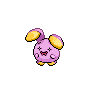
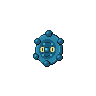
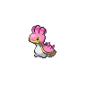
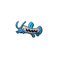

# Wellspring cave - 1f

| Area                                                                             | Pokemon                                                                                         | &nbsp;                                                                                           | &nbsp;                                                                                         | &nbsp;                                                                                             | &nbsp;                                                                                 | &nbsp;                                                                                       |
| -------------------------------------------------------------------------------- | ----------------------------------------------------------------------------------------------- | ------------------------------------------------------------------------------------------------ | ---------------------------------------------------------------------------------------------- | -------------------------------------------------------------------------------------------------- | -------------------------------------------------------------------------------------- | -------------------------------------------------------------------------------------------- |
|  cave-normal              |   [Swoobat](#/pokemon/528)  20%    |   [Zubat](#/pokemon/041)  20%         |   [Geodude](#/pokemon/074)  10%   |   [Roggenrola](#/pokemon/524)  10% |   [Aron](#/pokemon/304)  10% |   [Whismur](#/pokemon/293)  10% |
|                                                                                  |   [Wooper](#/pokemon/194)  5%       |   [Bronzor](#/pokemon/436)  5%      |   [Axew](#/pokemon/610)  5%          |   [Teddiursa](#/pokemon/216)  5%    |
|  cave-special           |   [Beedrill](#/pokemon/015)  40%  |   [Diglett](#/pokemon/050)  40%     |   [Gible](#/pokemon/443)  20%       |
|  surf-normal              |   [Wooper](#/pokemon/194)  60%      |   [Shellos](#/pokemon/422)  40%     |
|  surf-special           |   [Quagsire](#/pokemon/195)  60%  |   [Gastrodon](#/pokemon/423)  40% |
|  fishing-normal     |   [Barboach](#/pokemon/339)  60%  |   [Tentacool](#/pokemon/072)  30% |   [Shellder](#/pokemon/090)  10% |
|  fishing-special  |   [Shellder](#/pokemon/090)  100% |