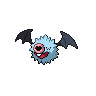
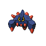

# Wellspring cave - b1f

| Area                                                                             | Pokemon                                                                                          | &nbsp;                                                                                           | &nbsp;                                                                                         | &nbsp;                                                                                       | &nbsp;                                                                                     | &nbsp;                                                                                       |
| -------------------------------------------------------------------------------- | ------------------------------------------------------------------------------------------------ | ------------------------------------------------------------------------------------------------ | ---------------------------------------------------------------------------------------------- | -------------------------------------------------------------------------------------------- | ------------------------------------------------------------------------------------------ | -------------------------------------------------------------------------------------------- |
|  cave-normal              |   [Woobat](#/pokemon/527)  20%       |   [Golbat](#/pokemon/042)  20%       |   [Graveler](#/pokemon/075)  10% |   [Boldore](#/pokemon/525)  10% |   [Lairon](#/pokemon/305)  10% |   [Steelix](#/pokemon/208)  10% |
|                                                                                  |   [Loudred](#/pokemon/294)  10%     |   [Quagsire](#/pokemon/195)  10%   |
|  cave-special           |   [Excadrill](#/pokemon/530)  50% |   [Dugtrio](#/pokemon/051)  50%     |
|  surf-normal              |   [Whiscash](#/pokemon/340)  60%   |   [Gastrodon](#/pokemon/423)  40% |
|  surf-special           |   [Gastrodon](#/pokemon/423)  40% |   [Whiscash](#/pokemon/340)  60%   |
|  fishing-normal     |   [Whiscash](#/pokemon/340)  100%  |
|  fishing-special  |   [Cloyster](#/pokemon/091)  100%  |